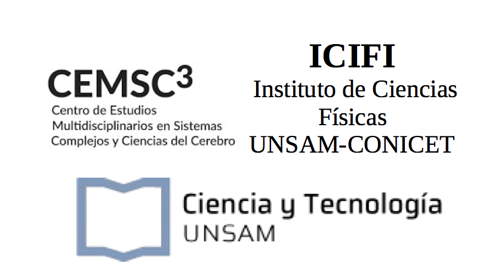
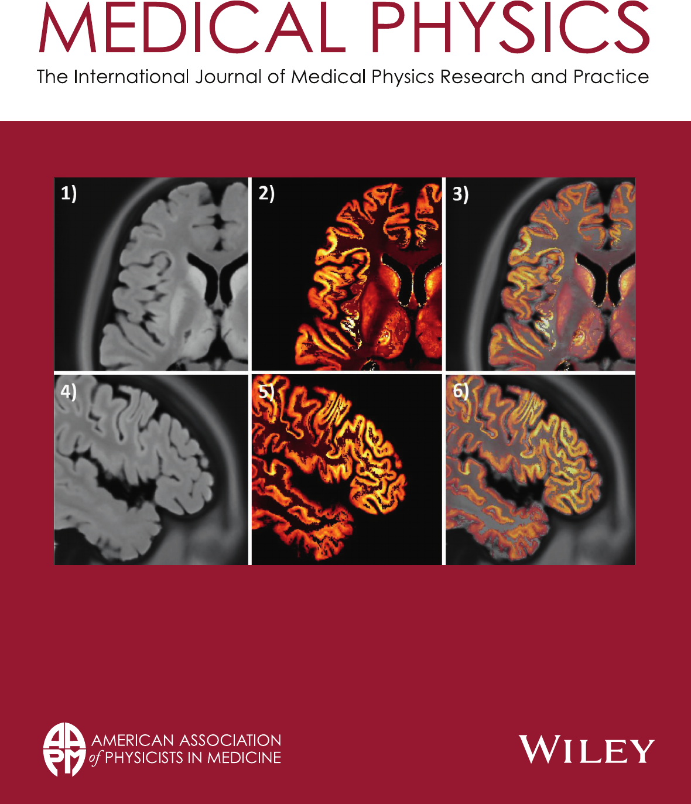

Latest
======
**March 2021** Estamos buscando postulantes para la convocatoria de Becas de Doctorado CONICET 2021. Podés encontrar [**más información sobre los temas acá.**](./people.md)

**March 2021** [**_En_**] I will be starting a new Medical Image Processing and Reconstruction group at the Universidad Nacional de 
San Martín.

[**_Es_**] En el transcurso del 2021 me incorporaré a la Escuela de Ciencia y Tecnología de la Universidad
Nacional de San Martín (UNSAM) con el objetivo de crear el Laboratorio de Procesamiento y Reconstrucción de Imágenes Médicas.
Me enfocaré en algoritmos avanzados de reconstrucción y procesamiento de neuroimágenes PET aplicados al estudio de marcadores 
para enfermedades neurodegenerativas, trabajando en conjunto con el Centro de Estudios Multidisciplinarios en Sistemas Complejos y 
Ciencias del Cerebro (CEMSC3) dirigido por Prof. Dante Chialvo.

    &nbsp;&nbsp;&nbsp;&nbsp;&nbsp;&nbsp;&nbsp;&nbsp;   

**August 2020** My technical note proposing a new ultra high-resolution realistic brain phantom is in the cover of 
the August issue of Medical Physics. [**Check the paper (open access)**](https://doi.org/10.1002/mp.14218).

<!----->

About Me
======
[**_En_**] I'm an electronic engineer and a scientist with a PhD in image processing interested in the basic science and translational application of
 novel medical image processing methods. Over the years, I have designed and
implemented a wide range of image processing and image reconstruction algorithms
in the field of PET and SPECT image reconstruction. Also, I have been involved
in the design of radiation detectors for nuclear medicine and other medical
devices. In the last years, I have focused on the translational aspects of medical image processing, 
first in the application of novel PET image reconstruction to study brain disorders and then in 
the application of image processing and deep learning methods for CT and MRI imaging in 
musculoskeletal applications.

[**_Es_**] Soy un ingniero electrónico y científico con un doctorado en procesamiento de imágenes
interesado en los aspectos básicos y translationales del procesamiento de imágenes médicas. A lo largo de 
mi carrera, he diseñado e implementado múltiples algoritmos de procesamiento y reconstrucción de imágenes
 para PET y SPECT. A su vez, he estado involucrado en el diseño y simulación de detectores de radiación para medicina 
nuclear, scanners y otros dispositivos. En los últimos años, me he concentrado en los aspectos translacionales 
del procesamiento de imágenes médicas, primero en la aplicación de nuevos métodos de reconstrucción de imágenes 
PET para el estudio de trastornos neurológicos y luego en la aplicación del procesamiento de imágenes de CT y MRI 
en aplicaciones musculoesqueléticas.

Previously on 'Latest'
======

