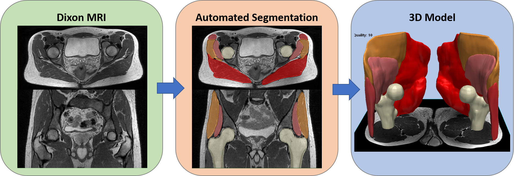

These are some of the research projects I have been working in the last years.

## PET Image Reconstruction Algorithms for Brain Imaging
In this figure, [18F]FDG brain images are shown for two different reconstruction
methods: Maximum Likelihood Expectation Maximization (MLEM) algorithm, the standard PET image reconstruction method,
and MR-Assisted MAP-EM reconstruction. The animation shows: 1) the same slice converging to a solution
during the reconstruction process, 2) all the slices for the final reconstructed image, and 3)
rotating Maximum Intensity Projections (MIPs).

## Hip Muscles Segmentation
Segmentation of the hip abductor muscles to study new image-based markers for muscle health and sarcopenia.

